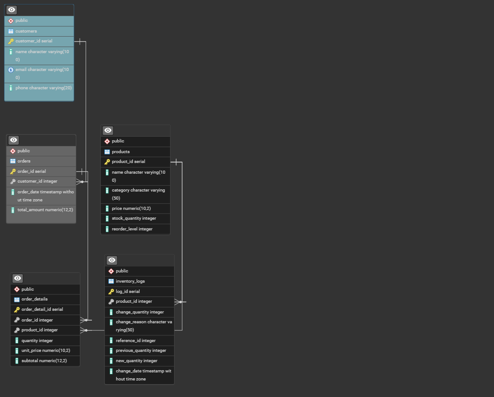

## Project Guide
+ Postgresql was used for this project
Run these meta-commands in your postgres terminal to create and connect to your database 
+ CREATE DATABASE inventory_db;

+ \c inventory 

### Project Deliverables

#### Phase 1: Database Design and Schema Implementation

+ schema_design.sql contains the necessary queries and commands for this

#### Phase 2 & Phase 4: procedure calls and triggers 
+ procedures_and_triggers.sql contains the solution to these phases

#### Phase 3 & Phase 5: Views for Reporting
+ views.sql contains the materialized views for these phases

### ER_Diagram for Database
