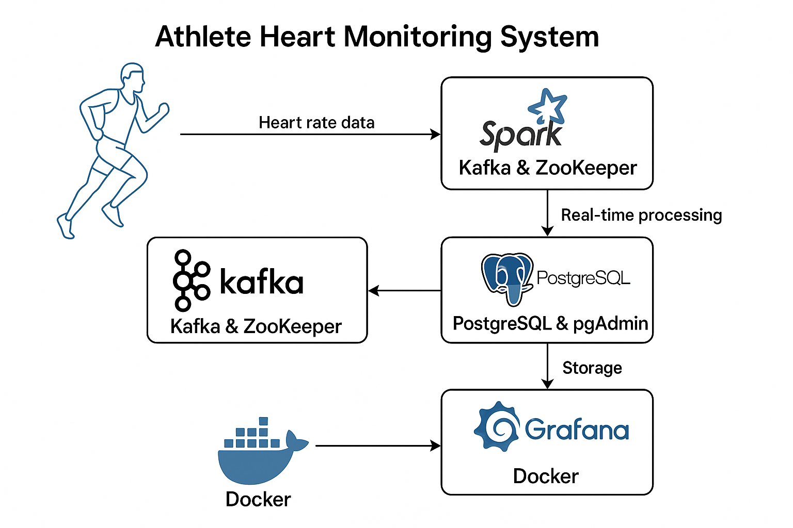

# Athlete Heart Monitoring System

## Overview
A real-time data processing pipeline that monitors athletes' heart rates during sports events using Kafka for streaming, Spark for processing, PostgreSQL for storage, and Grafana for visualization. The system tracks heart rates, detects abnormal conditions, and provides insights for medical staff and coaches.

## Key Components
- **Kafka & Zookeeper**: Message streaming and broker coordination
- **Spark**: Real-time data processing and cleansing
- **PostgreSQL & PGAdmin**: Data storage and database management
- **Grafana**: Visualization and alerting
### UI's for the project
- [**Grafana**](http://localhost:3000)
- [**pgAdmin**](http://localhost:8082)
- [**Spark Master UI**](http://localhost:8080)
- [**Spark Worker UI**](http://localhost:8081)


## Business Logic
- Real-time health monitoring (identifying dangerous heart rates: <40bpm or >150bpm)
- Automatic handling of missing data points
- Trend analysis and anomaly detection
- Real-time alerts for medical intervention

## System Setup and Testing

The goal of this project is to simulate near real-time heart rate monitoring for sporting events. The Grafana dashboards provide insights for identifying athletes at risk of cardiac arrests.

### Quick Start

#### One-Command Deployment
The entire system runs with a single command:
```bash
docker-compose up --build
```

This starts all services with:
- Pre-configured Kafka topic `sports_athlete_heartrates`
- Structured streaming in Spark 
- PostgreSQL table `athlete_heartrates`
- Grafana with automatic dashboard provisioning via `grafana_dashboard.yaml`
- Centralized configurations in `.env` file

#### Testing the Pipeline
1. Start the data generator:
   ```bash
   python scripts/data_generator.py
   ```

2. Access the Spark container:
   ```bash
   docker exec -it data_engineering_project-spark-1 bash
   cd /opt/spark/scripts
   ```

3. Run the Spark job:
   ```bash
   spark-submit --packages org.apache.spark:spark-sql-kafka-0-10_2.12:3.5.5 --jars /opt/spark/resource/postgresql-42.7.5.jar spark_transformation.py
   ```

### Accessing Services
- **Grafana**: http://localhost:3000
- **PGAdmin**: http://localhost:8082
- **Dashboard Snapshot**: [View Live](http://localhost:3000/dashboard/snapshot/RJcP5sol4vCklthYdnJz63cQ2d7V3nnl)

## Data Flow
1. Data generator simulates heart rates for athletes ATH001-ATH010
2. Data flows to Kafka topic `sports_athlete_heartrates`
3. Spark processes the stream and writes to PostgreSQL
4. Grafana visualizes the data with preconfigured dashboards

## Dashboard Highlights


The Grafana dashboard shows:
- Current heart rates for all athletes
- Historical trends and patterns
- Abnormal heart rate alerts (<40bpm or >150bpm)
- Activity status correlation with heart rate

## Project Components & Deliverables

This project includes all required components:

1. **Python Scripts**
   - `data_generator.py`: Simulates athlete heart rate data
   - `spark_transformation.py`: Processes Kafka streams in Spark

2. **SQL Schema**
   - Database schema file creates the `athlete_heartrates` table
   - Includes indexes for optimized queries
   - Creates views for abnormal heart rates (high >150bpm and low <40bpm)

3. **Docker Configuration**
   - `docker-compose.yml` orchestrates all services
   - `.env` file for centralized configuration

4. **Documentation**
   - This README with setup guide and system overview
   - Data flow diagrams and architecture details

5. **Sample Outputs**
   - Data samples and dashboard screenshots
   - Live dashboard snapshot link
   
### Data Flow




### Sample Data

