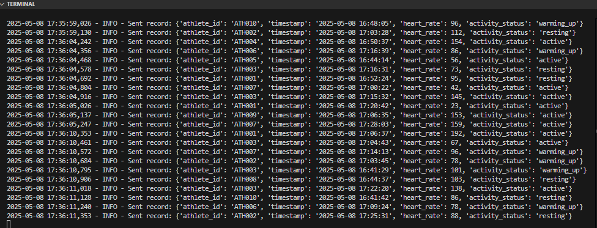
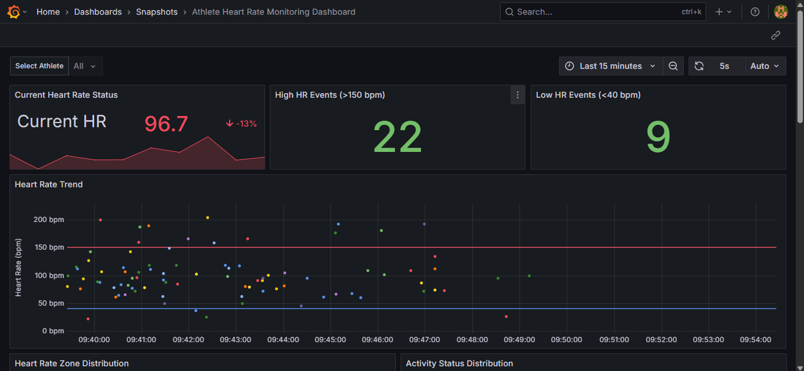
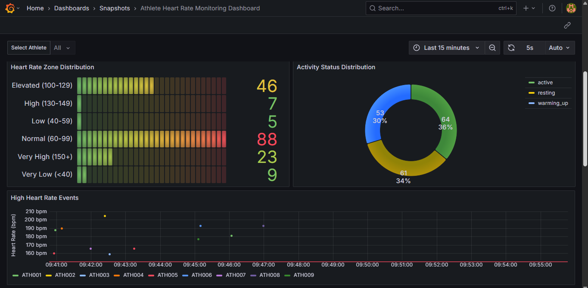
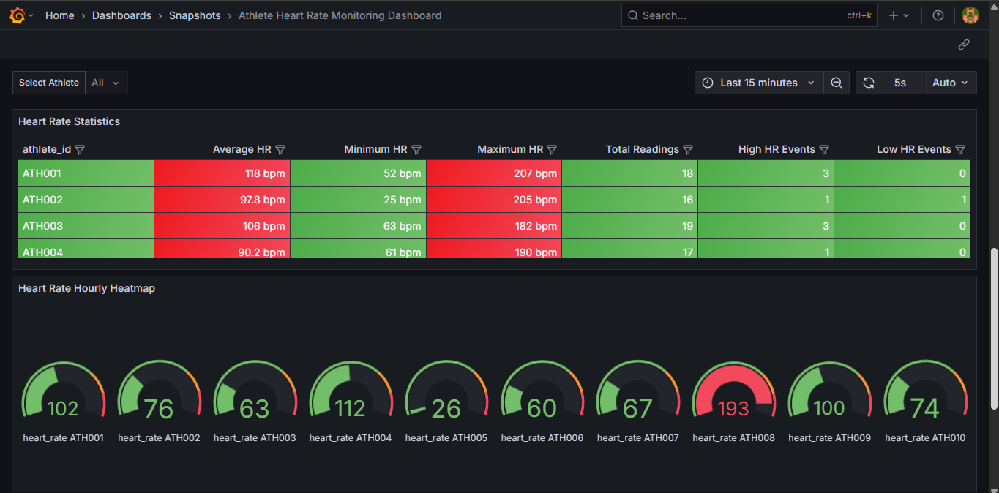
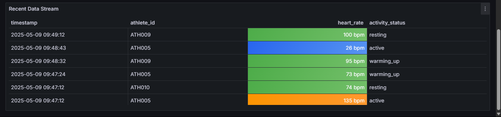

### System Setup and Testing

The goal of this project is to simulate near real-time heartrate monitor for a sporting events.
The use of Grafana dashboards help provide insights for athletes(ath) who at risk of cardiac arrests.

####  System Setup Using Docker Compose

Docker Compose is used to orchestrate the following services:

- **Kafka and Zookeeper**: For real-time message streaming.
- **PostgreSQL**: To store cleaned and transformed heart rate data.
- **Spark**: To stream-process data from Kafka and write it to PostgreSQL.
- **PGAdmin**: To manage and view PostgreSQL data.
- **Grafana**: To visualize athlete heart rate trends and anomalies.
-  **grafana_dashboard.yaml**: To provide automatic dashboard provisioning for Grafana

##### Key Setup Highlights:
- **Spark** reads from Kafka topic `sports_athlete_heartrates`.
- **Spark** processes data using structured streaming and writes the processed data to **PostgreSQL**.
- **PostgreSQL** stores data in the `athlete_heartrates` table.
- **Grafana** is provisioned with a PostgreSQL datasource and a JSON dashboard directory.
- The `.env` file centralizes configurations such as user credentials and Kafka broker settings.

---

#### Testing the Pipeline

 **data simulator** (`data_generator.py`) that:

- Randomly generates heart rate data for athletes `ATH001` to `ATH010`.
- Simulates time-based activity types like resting, warming up, and being active.
- Sends heart rate data to Kafka in batches every few seconds.

##### End-to-End Test Flow:
 Start all services with bash:
   - docker-compose up --build
   - python scripts/data_generator.py

   Run this in your terminal:
   - docker exec -it data_engineering_project-spark-1 bash
   
    Switch directory using :
    - cd /opt/spark/scripts 

    Run the Kafka Consumer and Spark by running this in the switched directory:
   - spark-submit --packages org.apache.spark:spark-sql-kafka-0-10_2.12:3.5.5 --jars /opt/spark/resource/postgresql-42.7.5.jar spark_transformation.py

##### DATAFLOW

   

##### Sample Data 
  

### Grafana Dashboard Snapshot  
[View the Dashboard Snapshot](http://localhost:3000/dashboard/snapshot/RJcP5sol4vCklthYdnJz63cQ2d7V3nnl)  

+   
+   
+   
+ 