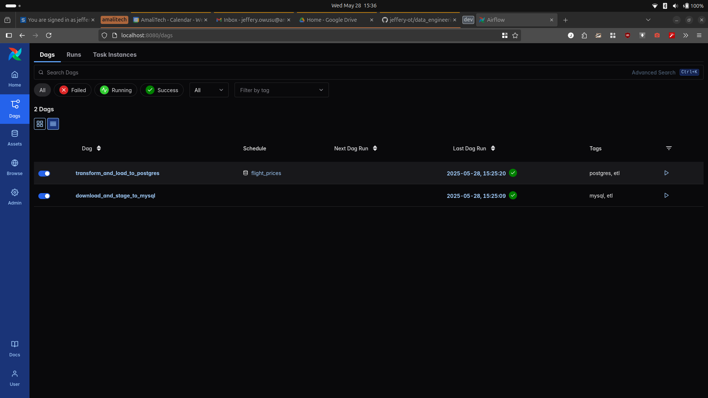
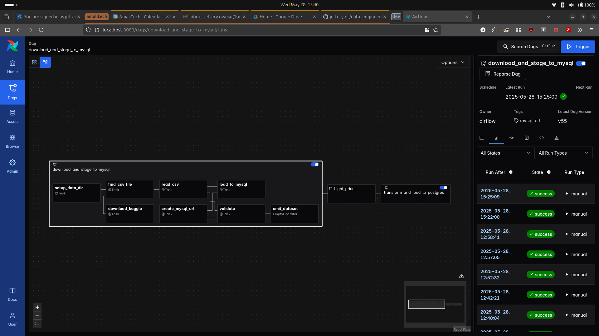
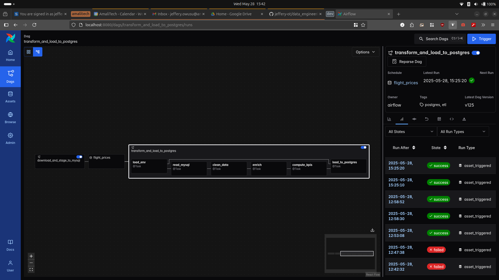
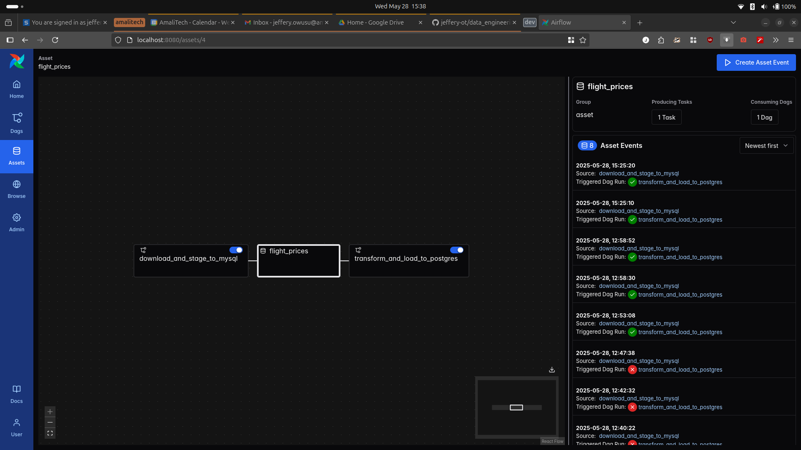
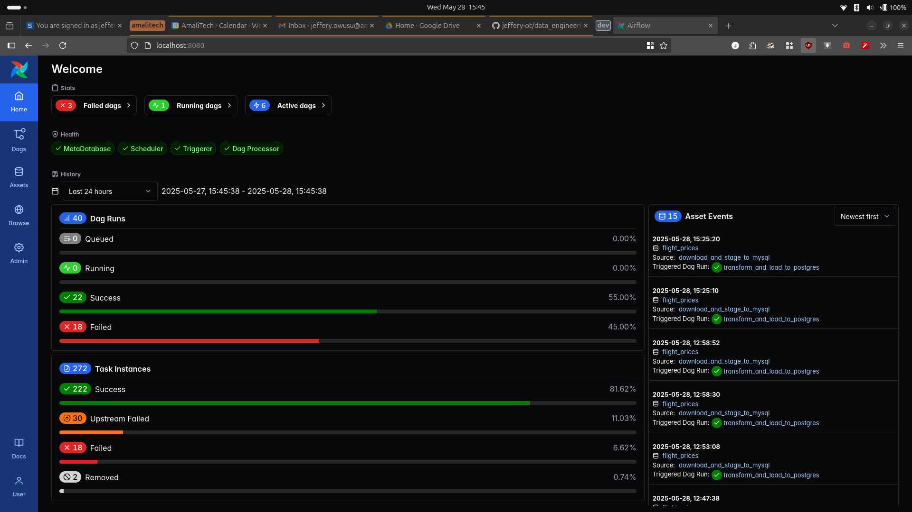

# Flight Price ETL Pipeline – Airflow Project

## Overview
================

#### Objective
Develop an end-to-end data pipeline using Apache Airflow to process and analyze flight price
data for Bangladesh. The pipeline must ingest raw CSV data, validate and transform it, compute
key performance indicators (KPIs), and store the final results in a PostgreSQL database for
further analysis.

#### What This Pipeline Does

1. **Download** flight price data from Kaggle using the API.
2. **Ingest** raw CSV into a MySQL `staging_db`.
3. **Validate** and **clean** the raw data (handling duplicates, nulls, data types).
4. **Enrich** the data with seasonality based on the journey date.
5. **Compute KPIs** (e.g., average prices by airline, route trends).
6. **Load** final tables into PostgreSQL for analysis.


- Start the environment with:
```bash
astro dev start --env .env --verbosity debug
````

- Trigger the DAG manually or via the Airflow UI.

##  DAG Design & Best Practices

* Used **TaskFlow API** (`@task`) for cleaner, Pythonic task definition.
* Logging to file enabled via custom `logger.py` (`data/logs`).
* Applied **separation of concerns** by splitting extraction and transformation into individual scripts.
* DAG scheduled using `@daily` with proper retries, dependencies, and alerting hooks.

## Issues Faced & Fixes

###### PostgreSQL Env Variables Not Loading

**Issue**: Airflow couldn’t read Postgres credentials properly, causing connection errors.

**Fix**: Forced the environment to load using:

```bash
set -a && source .env && set +a
```

#### Docker Network Inconsistencies

**Issue**: Containers (Airflow, MySQL, PostgreSQL) weren’t communicating due to network mismatches.

**Fix**: Used:

```bash
docker inspect <container>
```

to identify network names and updated `docker-compose.override.yml` with:

```yaml
networks:
  data-engineering-project_d7c572_airflow:
    external: true
```
**Issue**: A general lack of understanding of [airflow, astronomer] concepts use cases.

**Fix**: Read docs and some books with some video tutorials.

#### KPIs Calculated

* Average flight price per airline
* Route popularity and cost trends
* Seasonal pricing variations


## Airflow UI Snapshots
#### Dags from flight_etl_dag.py 


##### DAG: download_and_stage_to_mysql 


##### DAG: transform_and_load_to_postgres 


#### Asset 


#### Home



